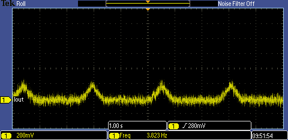

<!-- Please do not change this html logo with link -->

# Linear LED Current Regulator using PIC18F16Q41
Using only a few peripherals, the PIC18F16Q41 can be used as a linear constant current regulator for an LED based load. The key to this code example is the Q41's operational amplifier (OPA) module that directly controls the MOSFET which acts as a low-side current regulator.

## Related Documentation

<a href="https://www.microchip.com/wwwproducts/en/PIC18F16Q41">PIC18F16Q41 Product Information</a> 
TBxxxx, "Using Operational Amplifiers in PIC16 and PIC18" 
TBxxxx, "Optimizing Internal Operational Amplifiers for Analog Signal Conditioning" 
ANxxxx, "Analog Sensor Measurement and Acquisition" 
<a href="#">Code Example: Switching LED Current Regulator</a> 

## Software Used

* <a href="http://www.microchip.com/mplab/mplab-x-ide">MPLAB® IDE 5.40 or newer</a>
* <a href="https://www.microchip.com/mplab/compilers">Microchip XC8 Compiler 2.20 or newer</a>
* <a href="https://www.microchip.com/mplab/mplab-code-configurator">MPLAB® Code Configurator (MCC) 3.95.0 or newer</a>

## Hardware Used

* <a href="https://www.microchip.com/DevelopmentTools/ProductDetails/PartNO/DM164137"> Microchip Curiosity Development Board (DM164137) </a>

## External Parts Required

* 5.6 ohm resistor (current shunt)
* *(Optional)* 100k resistor
    * This resistor discharges the capacitor passively and ensures the MOSFET remains off if the part is off or the pin is tri-stated. For this example, it is not needed.
* N-Type MOSFET (rec. signal transistor, such as a 2N7000A)
* LED(s)

#### Power Dissipation
Before building or operating this demo, ensure that the parts selected for this demo are appropriately rated for the peak power of this circuit.

## Wiring
 

| Pin | Function
| --- | --------
| RA2 | DAC1 Output (connect to RA0 for the LED to breathe)
| RA0 | Current Set (Voltage input)
| RB5 | Current Sense Input
| RC2 | OPA Module Output (Amplified Current Sense)
| RC0 | Potentiometer Pin on the Curiosity (connect to RA0 for manual intensity control)

**Important:** RA0 must be connected to a signal (RA2 or RC0) for proper operation.

## Operation
This code example configures the DAC1 Output to generate a triangle wave output that is used by the operational amplifier to set the current through the LED. Analyzing the current-to-DAC output is complex, therefore a MINDI model is provided to help simulate the performance of the circuit. The image below shows the voltage on the current sense resistor.

 
*Output current waveform*

#### Short Circuit Protection
Due to the MOSFET acting as voltage controlled current sink, there is some short circuit protection built into the circuit. However, it is not recommended to depend on this circuit as the only means of protection. Prolonged short circuits may cause heating of the FET and shunt.

## Summary
This code example demonstrates the PIC18F16Q41's operational amplifier in use as a current regulator for LEDs.   
