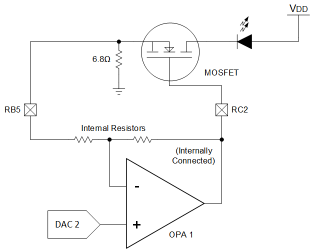

<!-- Please do not change this html logo with link -->

# Constant Current LED Regulator for PIC18F16Q41
Using only a few peripherals, the PIC18F16Q41 can be used as a constant current regulator for an LED based load. The key to this code example is the Q41's operational amplifier (OPA) module which is used as a low-side current amplifier. A comparator and configurable logic cell are used to control the operating voltage of the MOSFET used in this example. A digital-to-analog converter (DAC) is also used to show how to create a breathing effect in the LEDs.

## Related Documentation

<a href="https://www.microchip.com/wwwproducts/en/PIC18F16Q41">PIC18F16Q41 Product Information</a> 
TBxxxx, "Using Operational Amplifiers in PIC16 and PIC18" 
TBxxxx, "Optimizing Internal Operational Amplifiers for Analog Signal Conditioning" 
ANxxxx, "Analog Sensor Measurement and Acquisition"

## Software Used

* <a href="http://www.microchip.com/mplab/mplab-x-ide">MPLAB® IDE 5.40 or newer</a>
* <a href="https://www.microchip.com/mplab/compilers">Microchip XC8 Compiler 2.20 or newer</a>
* <a href="https://www.microchip.com/mplab/mplab-code-configurator">MPLAB® Code Configurator (MCC) 3.95.0 or newer</a>

## Hardware Used

* <a href="https://www.microchip.com/DevelopmentTools/ProductDetails/PartNO/DM164137"> Microchip Curiosity Development Board (DM164137) </a>

## External Parts Required

* 5.6 ohm resistor (current shunt)
* *(Optional)* 100k resistor
    * This resistor discharges the capacitor passively and ensures the MOSFET remains off if the part is off or the pin is tri-stated. For this example, it is not needed.
* 10k resistor
* 0.1uF capacitor
* N-Type MOSFET (rec. signal transistor, such as a 2N7000A)
* LED

#### Power Dissipation
Before building or operating this demo, ensure that the parts selected for this demo are appropriately rated for the peak power of this circuit.

The parts that dissipate the most power are the 5.6 ohm shunt resistor, the MOSFET, and the LED. Some parts **may become warm or hot** during operation.

## Wiring
 

| Pin | Function
| --- | --------
| RA2 | DAC1 Output (connect to RA0 for the LED to breathe)
| RA0 | Current Set (Voltage input)
| RB5 | Current Sense Input
| RC2 | OPA Module Output (Amplified Current Sense)
| RC0 | Potentiometer Pin on the Curiosity (connect to RA0 for manual intensity control)

**Important:** RA0 must be connected to a signal (RA2 or RC0) for proper operation.

## Operation
This code example has two modes of operation - a "breathing" mode or manual intensity control. The DAC1 (1) output on RA2 creates the breathing effect, while the RC0 pin on the Curiosity board is the location of the on-board potentiometer which can be used to manual tweak the intensity. An external wire is used to select RC0 or RA2.

For all configurations, the current the device tries to pass through the transistor is equal to **Imax = Vset / (Gain x Sense Resistor)**.
The default gain of the operational amplifier in the code example is a gain of 8.

(1) - Digital to Analog Converter

#### Breathing Mode

 
*Breathing Demo*

The breathing demo uses the 1.024V Fixed Voltage Reference (FVR) with the DAC to generate a triangle wave output. The maximum current for this mode is **18.8mA.**

 
*Output of the OPA module in breathing mode*

#### Intensity Control Mode

In this mode, the potentiometer of the Curiosity board is used to adjust the brightness of the LED.   ** Warning: This mode can output much more current than breathing mode**.  

The potentiometer goes between Vdd and Vss, giving a range of 0 to 5V for setting the output current. The max current that can be set with the default gain and parts is **91.9mA.**

It is unlikely that this can be reached with the LED supply at 5V, however testing with a blue LED, 2N7000A, and a 6.8 ohm shunt showed a max of 83.8mA of current through the transistor.

#### Short Circuit Protection
Due to the MOSFET acting as voltage controlled current sink, there is some short circuit protection built into the circuit. However, it is not recommended to depend on this circuit as the only means of protection. Prolonged short circuits may cause heating.

## High Voltage Operation
This code example can be run at voltages in excess of Vdd. Running at a higher voltage enables more LEDs to be strung together in series. However, some circuit modifications should be made to handle the higher operating power and to handle the case where an input to the device is exposed to a voltage higher than Vdd, which will cause permanent damage.

## Summary
This code example demonstrates the use of multiple peripherals on the PIC18F16Q41 to control the current through an LED with little CPU overhead required.  
