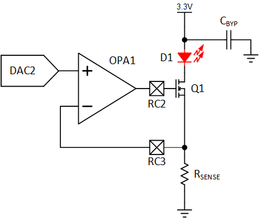

# Linear LED Current Regulator using PIC18F16Q41
Using only a few peripherals, the PIC18F16Q41 can be used as a linear constant current regulator for an LED based load. The key to this code example is the Q41's operational amplifier (OPA) module that directly controls the MOSFET which acts as a low-side current regulator. The output of the OPA is controlled by using the digital-to-analog (DAC) converter.

## Related Documentation
The following documents and resources will be published soon.
TBxxxx, "Using Operational Amplifiers in PIC16 and PIC18" 
TBxxxx, "Optimizing Internal Operational Amplifiers for Analog Signal Conditioning" 
ANxxxx, "Analog Sensor Measurement and Acquisition" 
<a href="https://github.com/microchip-pic-avr-examples/pic18f16q41-switching-led-current-regulator">Code Example: Switching LED Current Regulator</a> 

## Software Used

* <a href="http://www.microchip.com/mplab/mplab-x-ide">MPLAB® IDE 5.40 or newer</a>
* <a href="https://www.microchip.com/mplab/compilers">Microchip XC8 Compiler 2.20 or newer</a>
* <a href="https://www.microchip.com/mplab/mplab-code-configurator">MPLAB® Code Configurator (MCC) 3.95.0 or newer</a>

## Hardware Used

* <a href="https://www.microchip.com/wwwproducts/en/PIC18F16Q41">PIC18F16Q41</a> 
* <a href="https://www.microchip.com/DevelopmentTools/ProductDetails/PartNO/DM164137"> Microchip Curiosity Development Board (DM164137), Rev 4</a>

## External Parts Required

* 6.8 ohm resistor (current shunt)
* 100k ohm resistor
    * This resistor ensures the MOSFET remains off if the part is off or not configured.
* N-Type MOSFET (rec. signal transistor, such as a 2N7000A)
* LED(s)

#### Power Dissipation
Before building or operating this demo, ensure that the parts selected for this demo are appropriately rated for the peak power of this circuit.

## Wiring
 

| Pin | Function
| --- | --------
| RB5 | Current Sense Input
| RC2 | OPA1OUT (Connect to the gate of the MOSFET)

## Operation
 
*Example Output*

This code example configures the DAC2 to generate a triangle wave output that is used by the operational amplifier to set the current through the LED. The operational amplifier tries to set the current through the shunt resistor such that the voltage on the shunt (I x Rs) is equal to output of the DAC.

The output current is approximately equal to **Iout = Vdac / 6.8**.

 
*Voltage Across the Shunt Resistor*

#### Short Circuit Protection
Due to the MOSFET acting as voltage controlled current sink, there is some short circuit protection built into the circuit. However, it is not recommended to depend on this circuit as the only means of protection. Prolonged short circuits may cause heating of the FET and shunt.

#### Higher Voltage Operation
It is possible to run the LED supply at a voltage much higher than Vdd. Parts used must be evaluated for power dissipation and operating voltage. In addition, protecting the PIC18F16Q41 from voltages higher than Vdd is critical.

**Warning: The input to any power or I/O pin on the PIC18F16Q41 must remain within the absolute maximum ratings stated in the device datasheet, otherwise permanent damage may occur.**

#### Power Supply Oscillations
In some setups with high inductance on the power supply, oscillations may occur in the waveform. In the event this occurs (generally with external supplies that have long leads), decoupling the LED supply near the LEDs assists in reducing or removing this effect.

## Summary
This code example demonstrates the PIC18F16Q41's operational amplifier in use as a current regulator for LEDs.   
